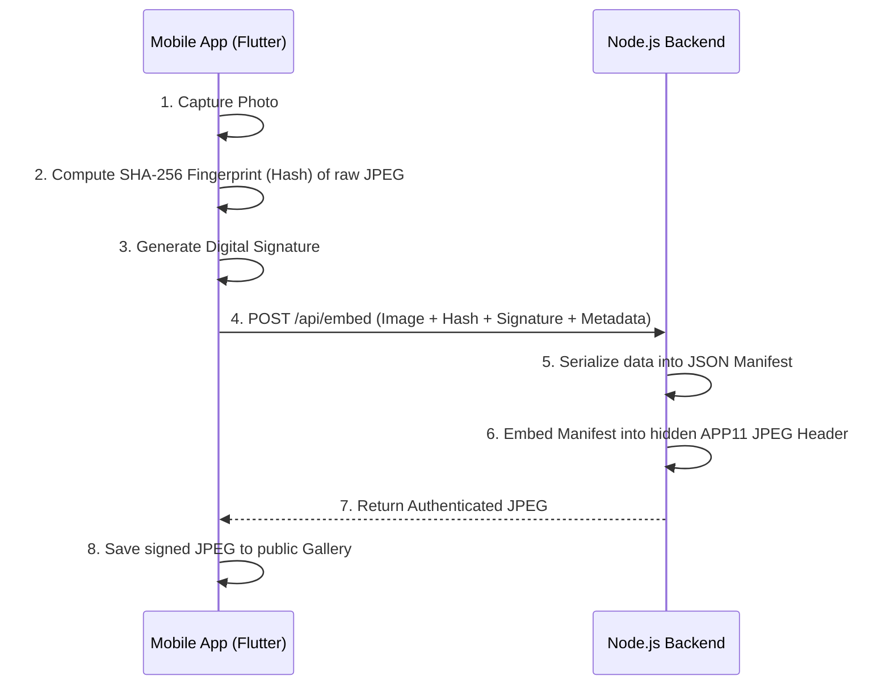

# TrustLens (TrueLens)

TrustLens is a secure camera and image verification platform designed to combat image tampering and guarantee digital authenticity. It consists of a mobile camera application built in Flutter and a cryptographic backend verification server built in Node.js.

## Architecture Flow



## What is it solving?
In an era where digital manipulation and AI-generated content are increasingly prevalent, it is difficult to mathematically prove the provenance and integrity of a photograph. TrustLens solves this by securely cryptographically signing the image at the time of capture and embedding that metadata directly into the image file. This allows anyone to definitively verify if an image is authentic, or if its pixels/data have been tampered with after the photo was taken.

## Deep Dive: Hashing, Fingerprints, and Metadata
- **Hashing & Fingerprints**: When a picture is taken, we run the raw binary pixel data of the image through a cryptographic one-way hash mathematical function (`SHA-256`). This hash acts as an unforgeable **"fingerprint"** of the image. Changing even a single pixel in the image will drastically change this fingerprint, allowing us to detect if an image has been manipulated.
- **Is there a Watermark? Where is the Metadata?**: TrustLens does **not** use a visible watermark that obscures or ruins the visual appearance of your photo. Instead, it uses **invisible metadata embedding**. The cryptographic information (the hash fingerprint, digital signature, public key, timestamp, and device info) is compiled into an internal JSON string. This data is then securely injected directly into the hidden **`APP11` segment** of the image's binary structure. The image looks completely normal to the human eye but carries verifiable proof under the hood.
- **Is it signed in only one format?**: Yes, currently TrustLens is designed specifically around the **JPEG** format (`.jpg`, `.jpeg`). It surgically embeds data into JPEG-specific headers. Attempting to use a PNG or WEBP will be rejected. On the cryptographic side, however, the digital signature algorithm embedded inside the JPEG is flexible (supporting `ES256`, `Ed25519`, and `RS256`).

## Architecture & How It Works

The project is split into two primary components:

### 1. The Mobile App (`TrustLens-main/camera_app`)
A Flutter application that serves as the end-user camera interface. 
- **Capture & Hashing**: When a user takes a photo, the app immediately calculates a `SHA-256` hash of the raw image bytes.
- **Signing**: It generates a cryptographic signature using the device's public/private key pairs (or simulated keys in the current demo mode).
- **Network Request**: It sends the raw JPEG bytes, alongside the image hash, signature, public key, and device metadata to the backend processor via the `/api/embed` endpoint.
- **Storage**: Upon receiving the cryptographically signed JPEG back from the server, the app saves it directly to the user's public Gallery. It also offers an interface to pass previously captured photos to the server for verification.

### 2. The Verification Server (`TrustLens-master`)
A Node.js Express server that acts as the cryptographic engine.
- **Embedding (`/api/embed`)**: Receives the raw image and metadata from the mobile app. It constructs a JSON manifest containing the signature, hardware data, and hash. It then embeds this serialized manifest directly into the raw JPEG file as an `APP11` metadata segment and returns the modified JPEG.
- **Verification (`/api/verify`)**: A detailed 4-step cryptographic check occurs when an image is submitted for verification:
  1. **Extraction**: The server scans the JPEG binary and extracts the hidden `APP11` JSON manifest containing the signature, the original image hash, and the public key.
  2. **Stripping**: To ensure an accurate hash check, the server temporarily strips out the `APP11` TrustLens metadata. This is crucial because adding the metadata to the image originally altered the file's binary footprint. Stripping it returns the file to its pure, original captured state.
  3. **Hash Comparison**: The server re-computes a fresh `SHA-256` hash of these stripped, raw image bytes. It then compares this newly calculated hash against the hash that was saved inside the manifest. If they match perfectly, it proves not a single pixel has been altered or compressed since capture.
  4. **Signature Verification**: Finally, the system verifies the digital signature in the manifest using the provided public key. This mathematically proves that the original hash was genuinely created and signed by the device hardware, and wasn't forged by a malicious user later.
  
  Based on this flow, the server returns:
  - `AUTHENTIC` if hashes align perfectly and signatures are valid.
  - `TAMPERED` if the re-computed hash diverges from the stored hash (meaning pixels/data were modified).
  - `NO_METADATA` if no TrustLens `APP11` segment is found inside the image.

## Cryptography & Algorithms

TrustLens relies on industry-standard algorithms to ensure mathematical provability:
- **Hashing**: `SHA-256` is used to create a unique fingerprint of the exact pixel data of the image.
- **Digital Signatures**: The server architecture inherently supports three highly secure signature algorithms:
  - **ES256** (ECDSA P-256 paired with SHA-256) *(Default)*
  - **Ed25519** (Standard EdDSA algorithm)
  - **RS256** (RSA-PKCS1v15 paired with SHA-256)

---

## Getting Started

### 1. Starting the Backend Server
Navigate into the backend directory, install packages, and start the server.

```bash
cd TrustLens-master/TrustLens-master
npm install
node server.js
```
*The server will start locally, usually on `http://localhost:3000`.*

### 2. CRITICAL: The `ipconfig` Network Change for the App
Because the Flutter app will likely be tested on a physical device, Android Emulator, or iOS Simulator, it cannot use `localhost` to connect to the Node server. Instead, it must use the actual local IP address of your computer.

1. Open your terminal or Command Prompt.
2. Run `ipconfig` (Windows) or `ifconfig` (Mac/Linux).
3. Find your **IPv4 Address** (e.g., `10.97.123.247`, `192.168.1.5`).
4. Open the Flutter file located at `TrustLens-main/camera_app/lib/crypto_engine.dart`.
5. At the top of the `CryptoEngine` class, update the `apiBaseUrl` variable to match your IPv4 address:

```dart
// Change this to match your ipconfig address:
static const String apiBaseUrl = 'http://192.168.X.X:3000';
```

### 3. Starting the Flutter Application
Navigate into the Flutter project, fetch dependencies, and run it on your device/emulator.

```bash
cd TrustLens-main/TrustLens-main/camera_app
flutter pub get
flutter run
```
